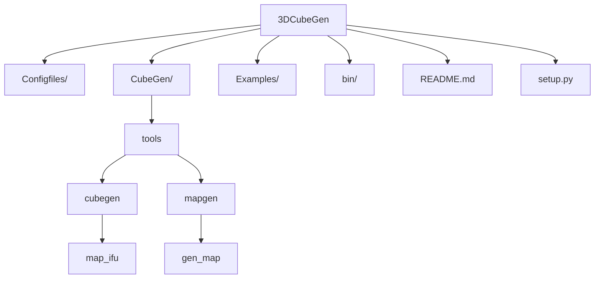

# 3DCubeGen

```mermaid
graph TD
    A[3DCubeGen] --> B[Configfiles/]
    A --> C[CubeGen/]
    A --> D[Examples/]
    A --> E[bin/]
    A --> F[README.md]
    A --> G[setup.py]
    C --> C1[tools]
    C1 --> C2[cubegen]
    C1 --> C3[mapgen]
    C2 --> C4[map_ifu]
    C3 --> C5[gen_map]
```