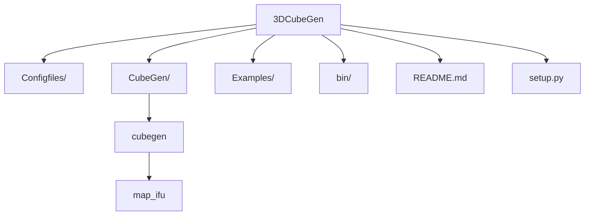

# 3DCubeGen

```mermaid
graph TD
    A[3DCubeGen] --> B[Configfiles/]
    A --> C[CubeGen/]
    A --> D[Examples/]
    A --> E[bin/]
    A --> F[README.md]
    A --> G[setup.py]
    C --> C1[cubegen]
    C1 --> C2[map_ifu]
```