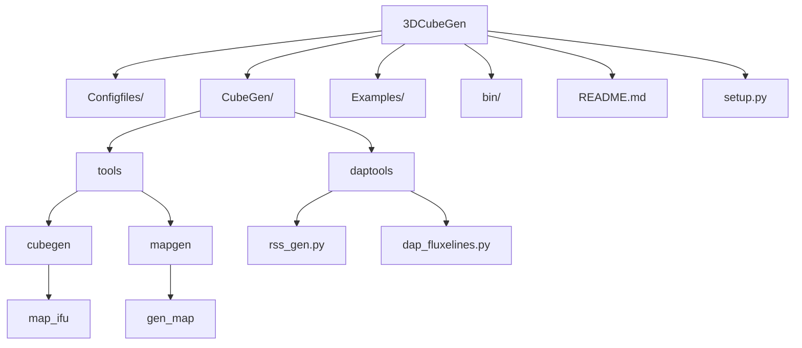

# 3DCubeGen (dev)

3DCubeGen is a reconstruction toolkit to generate **IFU maps**, **3D
datacubes**, and **RSS products** from reduced frame products (e.g., LVM
SFrames). It implements a configuration-driven reconstruction workflow
designed for both **pipeline production runs** and **single targeted
reconstructions**.

This repository provides four main command-line executables:

-   **pipemap** → automated batch generation of reconstructed maps\
-   **pipecube** → automated batch generation of reconstructed cubes +
    optional RSS\
-   **sinmap** → single-run map reconstruction with explicit inputs\
-   **sincube** → single-run cube reconstruction with explicit inputs

This documentation targets the **dev branch**.

The full documentation can be looked at https://hjibarram.github.io/3DCubeGen/

------------------------------------------------------------------------

# Installation

## Recommended: install from dev branch

``` bash
git clone -b dev https://github.com/hjibarram/3DCubeGen.git
cd 3DCubeGen
pip install -e .
```

Verify installation:

``` bash
pipemap --help
pipecube --help
sinmap --help
sincube --help
```

------------------------------------------------------------------------

# Core Concepts
<!--
## How `NAME` is used (IMPORTANT)

In 3DCubeGen configs, the string `NAME` in:

    basename: lvmSFrame-NAME.fits

is **not** a science target substitution.

Instead, `NAME` is the **dataset / reconstruction key** used by
3DCubeGen to locate the exposure bookkeeping required for
reconstruction, including:

-   tile lists
-   exposure numbers
-   MJDs
-   associated metadata

This identifier is also used to generate the names of the final
products:

-   reconstructed maps
-   reconstructed cubes
-   reconstructed RSS products

> **Think of `NAME` as the reconstruction job identifier (dataset
> definition + output basename), not the object label.**

------------------------------------------------------------------------
-->
## Pipeline mode vs Single-run mode

### Pipeline mode

-   **pipemap**
-   **pipecube**

Used for **production workflows** that automatically process one or more
datasets using standardized settings.

### Single-run mode

-   **sinmap**
-   **sincube**

Used for **one reconstruction job at a time** with more explicit control
over inputs and conditions:

-   debugging
-   validation
-   custom reconstruction settings
-   special exposure selections

------------------------------------------------------------------------

# Configuration System

3DCubeGen uses **YAML configuration files**.

Each config file contains:

1.  A **top-level key** matching the executable name
2.  A list of one or more reconstruction jobs

Example structure:

``` yaml
pipecube:
  - survey_type: LVM
    redux_dir: /path/to/redux
    out_path: /path/to/output
    basename: lvmSFrame-NAME.fits
    nproc: 8
```

------------------------------------------------------------------------

# Common Parameters

These appear across most workflows.

  -----------------------------------------------------------------------
  Parameter                           Meaning
  ----------------------------------- -----------------------------------
  `survey_type`                       Survey/instrument preset (e.g.,
                                      LVM).

  `redux_ver`                         Reduction version identifier.

  `redux_dir`                         Path containing reduced products
                                      used for reconstruction.

  `out_path`                          Output directory for generated
                                      products.

  `basename`                          Input basename template containing
                                      `NAME`.

  `type`                              Internal processing mode.

  `use_slitmap`                       Use slit/fiber geometry mapping.

  `path_sas`                          Path to SAS resources if required.

  `pbars`                             Enable/disable progress bars.

  `nproc`                             Number of parallel workers.

  `fac_sizeX`, `fac_sizeY`            Spatial footprint scaling factors.

  `cent`                              Enable reconstruction recentering.

  `coord_cenL` / `coord_cen`          Reconstruction center coordinates.

  `pathF`                             Path to auxiliary exposure lists.
  -----------------------------------------------------------------------

------------------------------------------------------------------------

# pipemap --- Pipeline Map Production

## Description

`pipemap` generates an **automatic set of reconstructed maps** for one
or more datasets defined in a configuration file.

Designed for batch production.

## Run

``` bash
pipemap config-map.yaml
```

(or depending on installation)

``` bash
pipemap -c config-map.yaml
```

------------------------------------------------------------------------

## Example --- Helix Nebula (exact configuration)

``` yaml
pipemap:
  - survey_type: LVM
    out_path: /mnt/NAS_A/QSO_group/MW_LVM/1.2.1.dev0/v3/Maps/
    redux_ver: 1.2.1.dev0
    redux_dir: /mnt/NAS_A/jmendez/FLUX_CAL
    type: j

    nameL: [Helix]
    basename: lvmSFrame-NAME.fits

    use_slitmap: True
    pbars: False
    path_sas: ''

    fac_sizeY: 1.2
    fac_sizeX: 1.2
    cent: False
    coord_cenL: [[0,0]]
       
    pathF: /home/hjibarram/MyNAS/Analisis/LVM_LV_ana/listMW/

    redshift: 0.0
    deconv: True
    psfdecv: 0.0
    
    nproc: 10
```

Run:

``` bash
pipemap config-map-Helix.yaml
```

------------------------------------------------------------------------

# pipecube --- Pipeline Cube + RSS Production

## Description

`pipecube` generates the **complete set of reconstructed datacubes** and
optional **RSS products** using standardized pipeline settings.

Designed for batch production.

## Run

``` bash
pipecube config-cube.yaml
```

------------------------------------------------------------------------

## Example --- Helix Nebula (exact configuration)

``` yaml
pipecube:
  - survey_type: LVM
    out_path: /mnt/NAS_A/QSO_group/MW_LVM/1.2.1.dev0/v3/Cubes/
    redux_ver: 1.2.1.dev0
    redux_dir: /mnt/NAS_A/jmendez/FLUX_CAL
    type: j

    flu16: True

    nameL: [Helix]
    basename: lvmSFrame-NAME.fits

    use_slitmap: True
    pbars: False
    path_sas: ''

    errors: True

    fac_sizeY: 1.2
    fac_sizeX: 1.2
    cent: False
    coord_cenL: [[0,0]]
       
    pathF: /home/hjibarram/MyNAS/Analisis/LVM_LV_ana/listMW/

    mergecube: True
    nsp: 0

    cube2rss: True
    out_pathrss: /mnt/NAS_A/QSO_group/MW_LVM/1.2.1.dev0/v3/RSSs/

    nproc: 10
    
    force_merge: False
    index_reset: 0
```

Run:

``` bash
pipecube config-cube-Helix.yaml
```

------------------------------------------------------------------------

# sinmap --- Single Map Reconstruction

## Description

`sinmap` generates **one reconstructed map per run** with explicit
control over inputs and conditions.

Use cases:

-   debugging
-   validation
-   custom constraints
-   special reconstruction settings

## Run

``` bash
sinmap config-sinmap.yaml
```

## Template

``` yaml
sinmap:
  - survey_type: LVM
    redux_dir: /path/to/redux
    out_path: /path/to/output/maps

    name: DATASET_KEY
    basename: lvmSFrame-NAME.fits

    use_slitmap: true
    pbars: false

    fac_sizeX: 1.2
    fac_sizeY: 1.2
    cent: false
    coord_cen: [0,0]

    deconv: false
    nproc: 8
```

------------------------------------------------------------------------

# sincube --- Single Cube Reconstruction

## Description

`sincube` generates **one reconstructed cube per run** with explicit
control over inputs and conditions. RSS products may also be generated.

## Run

``` bash
sincube config-sincube.yaml
```

## Template

``` yaml
sincube:
  - survey_type: LVM
    redux_dir: /path/to/redux
    out_path: /path/to/output/cubes

    name: DATASET_KEY
    basename: lvmSFrame-NAME.fits

    use_slitmap: true
    pbars: false

    errors: true
    flu16: true

    fac_sizeX: 1.2
    fac_sizeY: 1.2
    cent: false
    coord_cen: [0,0]

    mergecube: true
    force_merge: false
    index_reset: 0
    nsp: 0

    cube2rss: true
    out_pathrss: /path/to/rss

    nproc: 8
```

------------------------------------------------------------------------

# Recommended Workflows

## Validate first, then produce

``` bash
pipemap config-map.yaml
pipecube config-cube.yaml
```

## Debug → pipeline production

1.  Test with `sinmap` or `sincube`
2.  Move validated parameters into pipeline configs

------------------------------------------------------------------------

# Troubleshooting

## Missing exposure bookkeeping

-   Verify dataset identifier (`NAME`)
-   Check `redux_dir`
-   Check auxiliary list paths (`pathF`)

## Merge not updated

-   Use `force_merge: True`
-   Remove previous merged products

## Slow runs

-   Reduce `nproc`
-   Disable progress bars (`pbars: False`)


# 3DCubeGen

